# AgroFlame — Crop Residue Burning Risk and Bioenergy Potential Mapper

District-level decision-support platform for Punjab and Haryana, India, that identifies where crop residue burning is most urgent and where Compressed Biogas (CBG) plants would be most profitable — turning satellite fire data into a policy-ready investment map.

**Live Dashboard:** https://crop-residue.streamlit.app/

## Overview

Every winter, farmers across North India burn millions of tonnes of crop residue because they lack an economically attractive alternative, driving severe air pollution across the region. AgroFlame reframes this as a market-driven opportunity: it quantifies where burning is most severe, how much recoverable biomass exists, and how profitable a CBG (bioenergy) plant would be at that location, giving policymakers and investors a single, data-backed answer to "where should we intervene first?"

The project processes **8.7 million satellite fire detections** (NASA FIRMS VIIRS), 13 years of crop production records, and daily climate data into **43 standardized district profiles**, scores each district on three independent indices using statistical and machine learning methods, and serves the results through an interactive public dashboard built with **Streamlit**.

## Problem Statement

Farmers burn crop residue because they lack an economically attractive alternative disposal method. CBG plants offer a market-driven incentive to clear fields sustainably, but where should these plants be built first? AgroFlame answers this with data instead of guesswork.

## Study Area

Punjab and Haryana, India — 43 districts spanning both states.

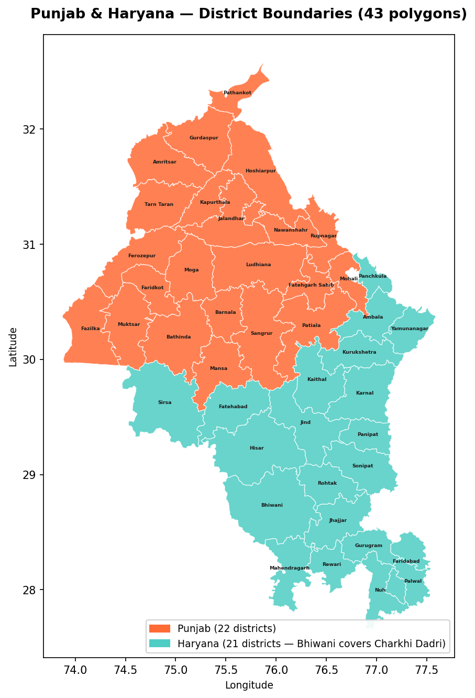

## Objectives

- Quantify historical and current crop-residue burning intensity at the district level.
- Convert recoverable residue volume into a projected bioenergy revenue opportunity per district.
- Cluster districts into environmental severity zones using climate and fire data.
- Synthesize all three signals into a final, ranked list of recommended bioenergy plant sites.
- Serve the results through a public, interactive dashboard for non-technical stakeholders.

## Data Sources

| Source | Data | Volume |
|---|---|---|
| NASA FIRMS (VIIRS) | Satellite fire detections | 8.7M points (2015-2023) |
| State Govt. / FAOSTAT | Crop production volume and area | 13 years (Punjab), 1 year (Haryana) |
| NASA POWER | Daily temperature, rainfall, humidity, windspeed | Full study period |
| ICAR / MNRE | Biomass-to-energy conversion metrics | — |
| GADM | District administrative shapefiles | 43 districts |

## Methodology — The Three-Module Framework

The pipeline runs across **17 modular Jupyter notebooks** (Python, Pandas, NumPy, Scikit-learn), organized into three analytical modules that feed a final decision layer.

### Module A — Urgency: Burning Risk Assessment (BRS, 0-100)

Filters 1.8 million fire points to quantify historical burning intensity and current trajectory using a **Mann-Kendall trend test**.

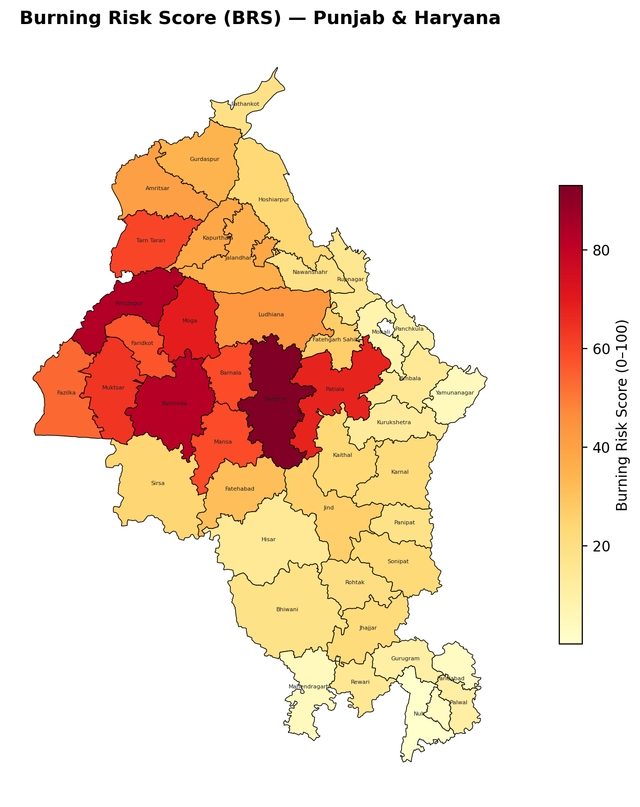

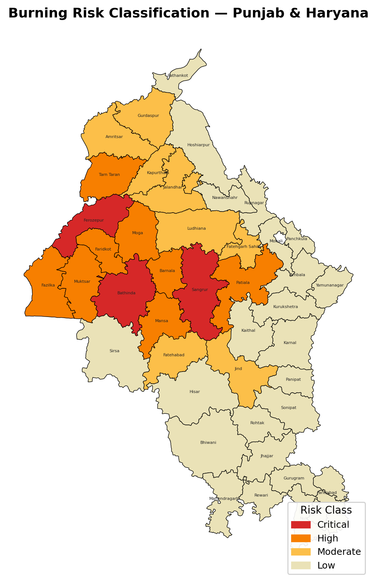

- Increasing risk trend detected in Faridabad.
- Decreasing risk trend detected in Sirsa.
- Highest urgency: Sangrur (BRS 93.1), followed by Ferozepur (83.5).

### Module B — Opportunity: Bioenergy Potential (BPS, 0-100)

Builds a residue-to-revenue logic tree: converts burned/recoverable residue fractions into energy yield (GJ/tonne to kg CBG) and projects revenue at the SATAT-preferred price of ₹46/kg.

- Sangrur scores a perfect BPS of 100, representing an estimated ₹85 Crore/year bioenergy opportunity.

### Module C — Context: Environmental Severity (BSI, 0-100)

Reduces high-dimensional climate and fire data via **Principal Component Analysis (PCA)**, then applies **K-Means clustering** to group 43 districts into 3 severity zones.

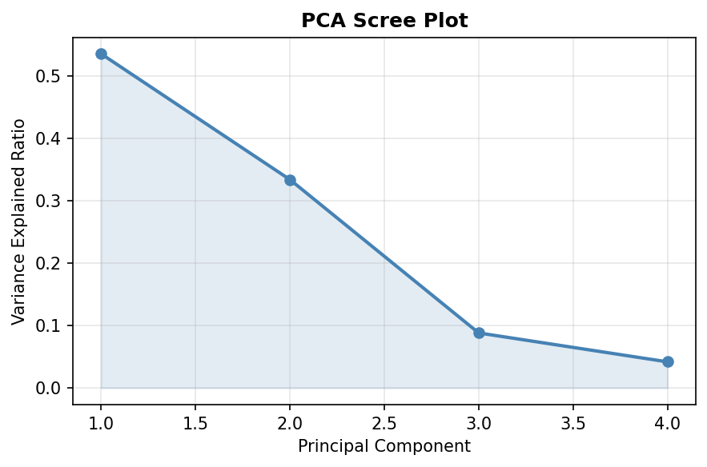

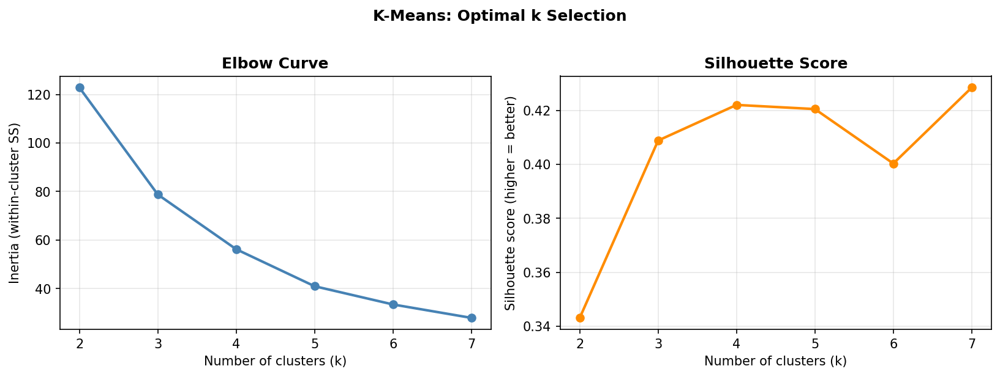

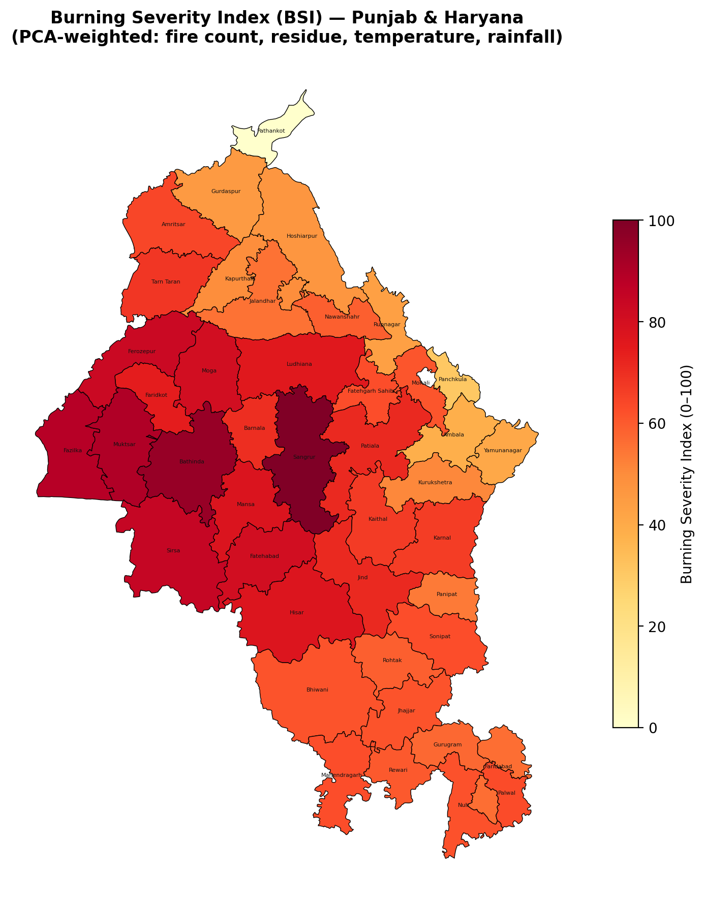

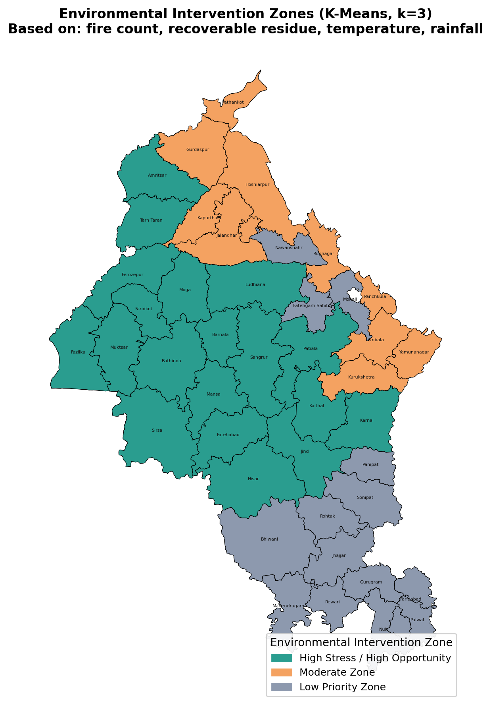

- Validated with elbow curve and silhouette score analysis.
- Stability confirmed via 200 bootstrap iterations — critical districts (e.g., Sangrur, Bhatinda) remain firmly placed regardless of data noise.

### Synthesis — The Decision Matrix

Combines all three scores into a prioritization matrix (Prime Intervention Targets / Policy-Subsidy Required / Low Priority) and a final plant zone recommendation covering 9 districts.

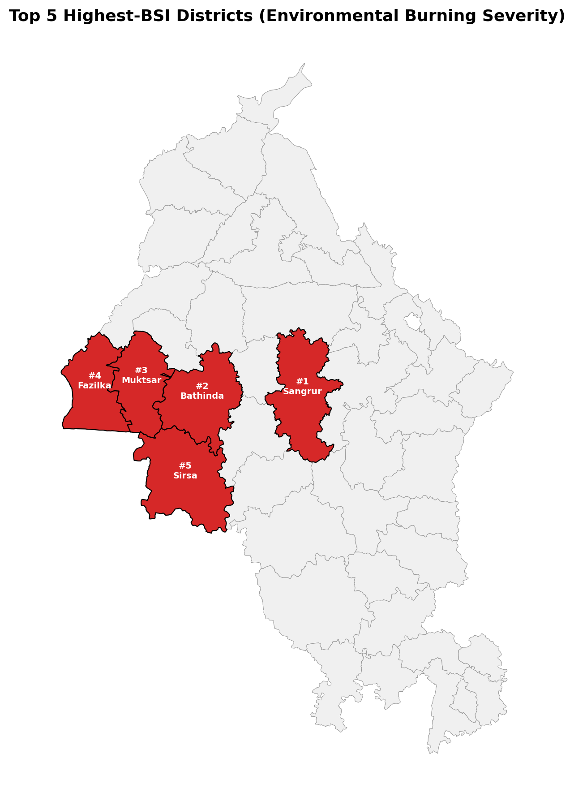

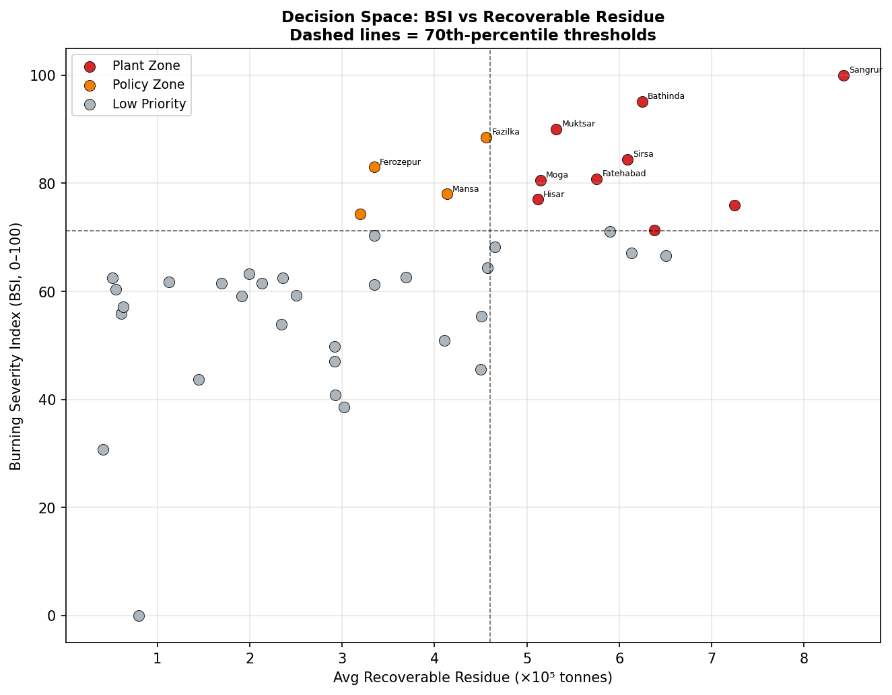

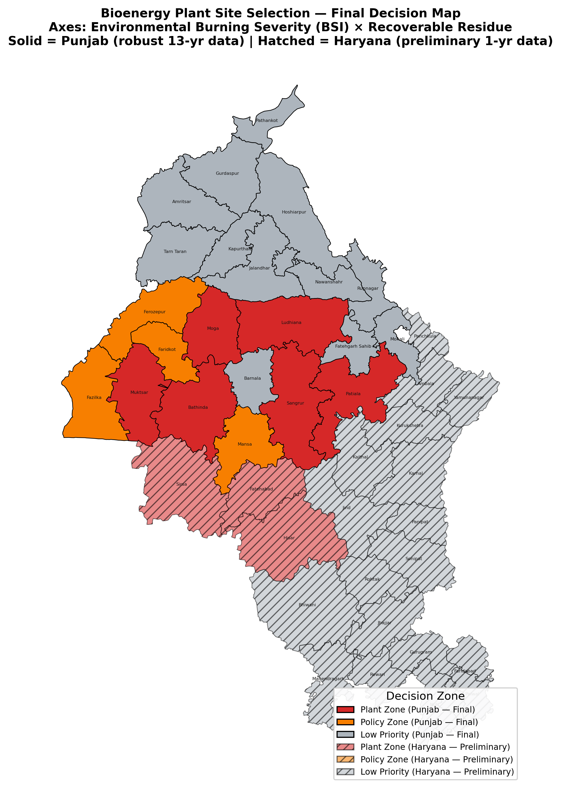

## Model Validation

- **200 validation rounds** with 80% random subsampling (37/47 districts per round).
- **97.8% of districts (46/47)** remained stably classified across all rounds.
- Only **Hisar** showed borderline behavior, a genuinely mixed fire/residue profile sitting at a natural cluster boundary, not a modeling error.

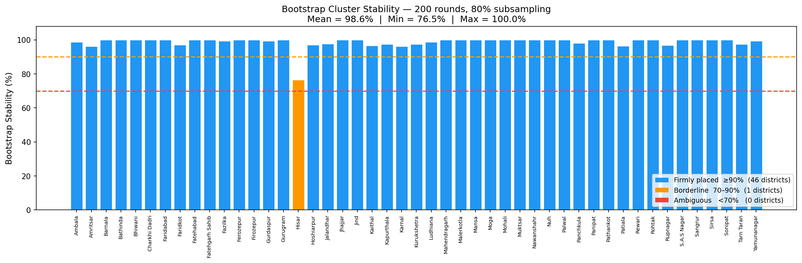

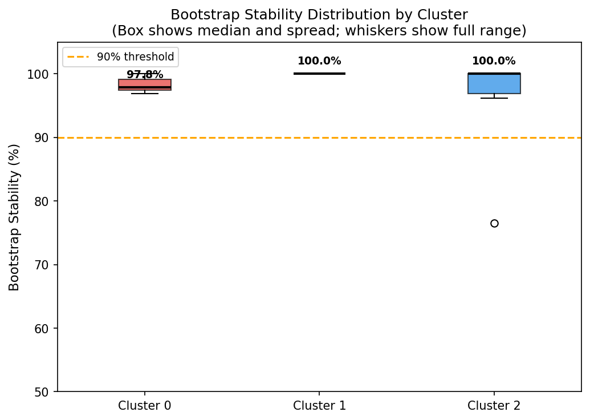

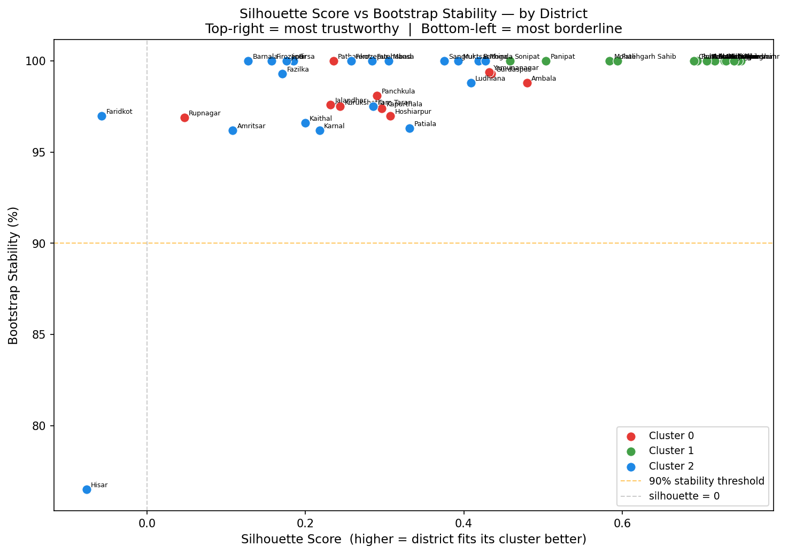

## Data Reliability and Confidence Index

Punjab and Haryana are scored using an identical methodology but reported with **different confidence tiers**, reflecting real differences in data depth.

| Attribute | Punjab | Haryana |
|---|---|---|
| Crop data depth | 13 years (robust, multi-season) | 1 year (2022-23, limited) |
| Confidence level | High / Final | Preliminary |
| Recommended next step | Immediate site feasibility studies | Multi-year validation |
| Priority districts | Sangrur, Ludhiana, Patiala | Sirsa, Fatehabad, Hisar |

This distinction was a deliberate design choice — the project avoids overstating certainty in regions where the underlying data doesn't yet support it.

## Dashboard

An interactive **Streamlit** dashboard exposes district-level scores, trend maps, and the final decision matrix to non-technical stakeholders (policymakers, investors).

## Repository Structure

```
AgroFlame/
├── Docs/                 # Project documentation and reference material
├── Notebooks/             # NB01-NB17: end-to-end pipeline (ingestion, ML, validation)
├── Outputs/               # Final scores, cluster assignments, decision matrix
├── assets/                # Result maps and charts (referenced in this README)
├── data/                  # Raw and processed datasets (FIRMS, crop stats, climate)
├── PROPOSAL.md            # Original project proposal
├── README.md
├── main.py                # Entry point / Streamlit app launcher
└── requirements.txt       # Python dependencies
```

## Tech Stack

**Python** (Pandas, NumPy, Scikit-learn) across 17 Jupyter notebooks for the end-to-end pipeline. **Mann-Kendall trend test** for burning trajectory detection. **PCA** and **K-Means clustering** for environmental severity zoning, validated with elbow curve, silhouette score, and 200-round bootstrap resampling. **Streamlit** for the public-facing interactive dashboard.

## Future Scope

- Extend multi-year crop data coverage to Haryana to upgrade its confidence tier.
- Integrate real-time VIIRS feeds for live fire-season monitoring.
- Add site-level feasibility scoring for the 9 recommended plant-zone districts.

## Team

Dhruv S. Soni, Mehul B. Chaudhary, Yash D. Daslaniya, Maharshi K. Patel, Tushar J. Vadodariya, Gopal Patidar

Submitted to: Mr. Prasun Kumar Gupta

## License

This project is licensed under the MIT License — see LICENSE for details.
